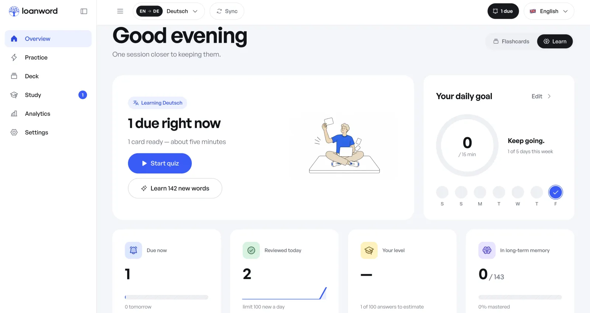
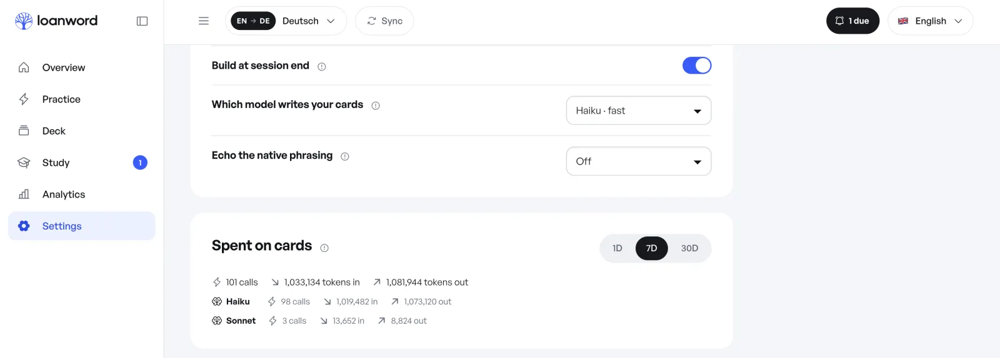

# The words you actually needed

[](LICENSE)
[](https://nodejs.org)
[](https://docs.claude.com/en/docs/claude-code/plugins)
[](#privacy)

Loanword is a Claude Code plugin. It watches the language you reach for while
you work, turns exactly those words into flashcards, and schedules them with
FSRS. The deck is yours because the gaps are yours — no one else's word list,
no textbook order, no account.

**Main idea: fit the foreign language to the shape of your native one.**

- **Works inside Claude Code.** Cards are written by the Claude you already
  pay for. No API key, no second subscription.
- **Everything stays on this machine.** No server, no account, no telemetry.
  The trainer binds to `127.0.0.1`.
- **One deck per language pair.** Learn `es → en` and `en → es` side by side,
  and capture into several of them at once.
- **Thirty-five languages in thirteen scripts:** Latin, Cyrillic, Greek,
  Hebrew, Arabic, Devanagari, Bengali, Thai, Ethiopic, Armenian, Georgian,
  Han and Hangul.

**Your own Quizlet, Duolingo and Memrise, on one machine.** The drills are the
ones you already know — a flashcard pile, four-choice learn mode, matching, a
graded test, a daily goal, a streak, typed production before anything counts as
learned. What is different is where the word list comes from: not a course, not
a top-2000 list, but the thing you could not say at 15:40 on Tuesday. No
account to make, no subscription to cancel, no server that could lose it.

## How it works


1. **You work as usual.** A `UserPromptSubmit` hook collects the phrases you
   reached for. Code, diffs and tool output are never captured.
2. **A session ends.** Claude turns the queue into cards: the word, what it
   means in your language, an example, a CEFR level, a category and a topic.
   A gate checks every card against the lexis rules and sends the broken ones
   back once for repair. Every call's tokens and cost are logged.
3. **You open the trainer.** Pick five, ten or fifteen minutes and review.
   FSRS decides when each card comes back.

## Install

```
/plugin marketplace add MarcSky/loanword
/plugin install loanword
```

The installer asks for your native language, the language you are learning and
the capture mode. Needs Node 22.13 or newer.

## Inside Claude Code

| Command | What it does |
|---|---|
| `/loanword:start` | Opens the trainer at `localhost:4747` |
| `/loanword:stats` | Progress: learned, streak, hardest words |
| `/loanword:ticker` | One card in the status line, a new one every ten seconds; `off` restores what was there before |

There is no build command inside Claude Code. When a session ends with ten or
more captured records, a detached `claude -p` reads the queue and writes the
cards; opening the trainer does the same for anything captured since. To force
it, use `loanword build` from the terminal, or open the queue from the
overview and start it by hand.

## The trainer

Six screens, served off disk, no build step, no framework, no network.

[](SCREENSHOTS.md)

- **Overview** — what is due, the daily-goal ring, four numbers, your
  categories, eight weeks of rhythm, and the build queue: open it to see every
  captured record before it becomes a card, drop the ones you do not want.
- **Practice** — three ways to drill without touching the FSRS schedule.
  *Flashcards* run a plain pile; *Learn mode* asks four choices and repeats
  what you miss; *Test* builds a paper: true-or-false, multiple choice,
  matching and written answers, graded at the end.
- **Deck** — search, filters, list or grid, edit in place, star, remove with
  undo. **Chapters** groups the deck by category and topic — code review,
  airport, standup — in parts of forty, each with its own Study button.
- **Study** — pick a length, get a planned session. A new card is shown once
  with both sides, then comes back three to five cards later as a typed
  question: it is never graded before you have produced it. Five exercises
  share one schedule — flashcards, learn, cloze, type it, reverse. Swipe left
  for Again, right for Good.
- **Analytics** — everything from your own review log, with a table behind
  every chart, and a Markdown or CSV copy of the lot.
- **Settings** — languages, categories, capture, study, appearance, your data.

**[Every screen, one at a time →](SCREENSHOTS.md)** — nine shots of a real
`en → de` deck, unflattering numbers and all.

**Keyboard.** `space` reveals, `1 2 3 4` grade, `enter` submits a typed answer,
`s` speaks, `d` junks, `u` undoes that, `r` gives five more minutes on the
summary, `1`–`6` switch screens, `/` searches, `t` toggles theme, `[` collapses
the sidebar, `?` lists the keys, `esc` leaves a session.

## Many languages at once

A deck is a pair — the language you write prompts in and the one you are
learning — and you can keep as many of them open as you like.

- **One queue per language.** Every active target gets its own
  `queue.<code>.jsonl`. A prompt is read once and appended to each of them in
  the same hook pass, so learning German *and* Spanish costs you the same
  keystrokes as learning one.
- **One switch per language.** Settings → *Capture into* pauses a language
  without deleting anything: a paused target keeps its deck and its schedule and
  simply stops collecting. The language you write in can never also be one you
  are learning.
- **One schedule per deck.** The FSRS state, the review log and the level
  estimate belong to the deck, not to you. Studying `en → de` never moves a card
  in `en → es`, and decks that teach the same language share only the capture
  switch.
- **Builds run side by side.** One lane per target, settled together: a language
  whose build fails does not hold up the others. `loanword build --target=ka`
  narrows it to one.
- **Decks seed each other.** See *Copy a deck* below.

The header switcher moves between them; `loanword --where` prints which decks
exist on disk.

**Copy a deck.** Starting a second language does not start from nothing. The
Sync button in the header takes the concepts you already learned — your own
phrasing, the category, the level, the star — and asks the builder for the new
side. The schedule is never copied and the deck you copied from is not touched.
A new script also offers its alphabet as a starter deck.

**Say it out loud.** Offline voices only: the browser's local ones first, then
Piper, macOS `say` or eSpeak NG on this machine. `loanword speech --lang=ka`
prints the one command that fetches a Piper voice — it never runs it, and no
audio ever leaves the machine.

Interface language is separate from the pair you learn. English ships in the
box, with Spanish, French, Portuguese, Russian, Hindi and Chinese beside it;
see [`ui/i18n/README.md`](ui/i18n/README.md) to add one.

## Your level

The trainer keeps one CEFR estimate per deck, from the answers you give it.
Every **first** graded answer to a card is an item response, and the estimate
moves with each one — Elo over the card's level and its FSRS difficulty. It
costs nothing: no model call, no placement test, and it never leaves the
machine. A band is named only after a hundred first answers, and never above
the hardest band the deck has actually tested ten times. Set a floor level in
Settings and your word beats the arithmetic; the builder then aims at the band
you named.

## What the cards cost



Cards are written by `claude -p` on this machine, as a bare completion: no
tools, no project context, no session history. Settings → *Which model writes
your cards* chooses between Haiku, Sonnet and Opus, and the spend panel below
it logs every call's tokens and cost, per model, over one, seven or thirty
days. Nothing is ever asked twice: only the cards the gate marked go back, in
one call per batch, and the filing pass runs on Haiku. Pronunciation is free
when eSpeak NG is on the machine, and costs a few tokens a card when it is not.

**Which model does what.** Sonnet is the default for the writing itself,
because a card you will see fifty times is worth one careful call; Haiku is
there for a cheap first deck and Opus for when you want the difficult half of a
language done properly. Two passes never ask you: filing — the category and the
topic of a card — always runs on Haiku, and the cheap roles (an alphabet deck,
the filer, a single sentence) run at low effort whatever you picked.

**When a call goes wrong, it is tuned, not repeated.** A call that costs more
than `MAX_CALL_USD` (3, or `LOANWORD_MAX_CALL_USD`) splits its batch in half
instead of trying again. `scripts/tune.mjs` reads why a call failed and answers
with exactly one change — walk the command line down `bare → lean → stream →
plain`, wait once when the model is busy, or halve the batch — and what worked
is remembered in `tuning.json` beside the deck, so the next build starts there.
Delete that file to make the trainer probe again.

## Two hooks, and nothing else

Loanword is a Claude Code plugin, so it does not watch your editor, your
clipboard or your terminal. It gets exactly two invitations, declared in
[`hooks/hooks.json`](hooks/hooks.json), and both of them run the same file.

| Hook | Runs | Budget |
|---|---|---|
| `UserPromptSubmit` | `scripts/capture.mjs --source=prompt` | 10 s |
| `SessionEnd` | `scripts/capture.mjs --source=session` | 30 s |

**On every prompt.** Your text is scrubbed of secrets, then split into
candidate words and phrases against the stop-list and a snapshot of what you
already know, and appended as one line per active language. The hook never
opens SQLite: it reads two plain-text snapshots the trainer keeps for it, which
is what makes it fast enough to sit in front of your keystroke and what lets
several languages capture at once without waiting on each other. It also
notices when a word you are currently learning turns up in your own prompt —
the strongest evidence a card has landed — and it is the only place the echo
line and the peek card are written back into the session.

**When the session ends.** Only candidate words are taken from the assistant's
replies, never the sentences, and only from its text: tool results and code
blocks in the transcript are skipped. Then, if `auto_build` is on and the
queues hold ten records or more, a detached `claude -p` is spawned to write the
cards and the hook returns — nothing blocks Claude Code from shutting down.

**Backpressure.** A queue over 4 MB stops accepting and says so in the log
rather than growing forever; `loanword build` drains it and capture resumes.

## Privacy

- Everything lives in `~/.claude/plugins/data/loanword*`, or in
  `CLAUDE_PLUGIN_DATA` when you set it. The server binds `127.0.0.1` only.
- Code, diffs and tool output are never captured. From assistant replies only
  candidate words are stored, never the sentence.
- Secrets are stripped before anything is written: the rules are in
  [`scripts/scrub.mjs`](scripts/scrub.mjs). Removed text leaves a `▮`.

Found a leak in `queue.jsonl`? That is a P0. Open an issue.

To keep client repositories out: install at `user` scope and
`claude plugin disable loanword` where it does not belong, or set
`mode: active` so only your own wording is captured.

## Settings

Set at install time, changeable from the trainer. Stored in `settings.json` in
the plugin data directory; the stored value wins.

| Option | Default | Meaning |
|---|---|---|
| `native_lang` | `es` | The language you write prompts in |
| `target_lang` | `en` | The language you are learning |
| `mode` | `both` | `active`: your prompts; `passive`: assistant replies |
| `daily_limit` | `15` | New cards per day, 3 to 100. Reviews are never capped |
| `auto_build` | `true` | Build cards when a session ends |
| `echo` | `off` | `line`: open every reply with the native phrasing of your prompt; `weave`: also work your ten weakest words into the answer |
| `level` | — | `A1`…`C2`: words below this level never become cards |
| `peek` | `false` | Print one card into the session while you wait for an answer |
| `peek_pick` | — | Which cards may appear: `starred`, `slipping`, `leech`, `new`, and any CEFR levels |
| `peek_every` | `15` | Minutes between those cards, 1 to 120 |

```
node scripts/store.mjs config    # effective settings
```

Language detection is local: different scripts by script, same-script pairs by
a function-word vote, Japanese and Chinese by kana, in
[`scripts/lang.mjs`](scripts/lang.mjs). Writing systems without spaces are
queued as short sentences rather than split into words.

## The `loanword` command

The trainer is also a plain CLI, for when you want it without Claude Code.

```
npm link                  # once, from the plugin folder; puts `loanword` on PATH
```

| Command | What it does |
|---|---|
| `loanword` | Serves the trainer and opens the browser |
| `loanword stop` | Closes it and releases the port |
| `loanword build` | Turns the queue into cards now |
| `loanword build --target=ka` | Builds one language instead of all of them |
| `loanword clone --from=en --to=ka` | Queues the concepts of one deck for another; the next build writes the cards |
| `loanword vet` | Which cards break the lexis rules; `--apply` repairs them |
| `loanword speech --lang=ka` | Says which offline voice would speak, and how to get one |
| `loanword peek` | Prints one card the way the hook does; `--pick=starred,B1` narrows it |
| `loanword tidy` | Lists migrated leftovers and old backups; `--remove` deletes them |
| `loanword migrate` | Moves a JSONL deck into SQLite; `--dry-run` shows what would happen |
| `loanword --stats` | Progress as JSON, for scripts |
| `loanword --where` | Which plugin copy and which deck it reads |

| Flag | Meaning |
|---|---|
| `--no-open` | Do not open the browser |
| `--host=lan` | Bind every interface and print a URL with a one-off token. Without it, loopback only |
| `--idle=<minutes>` | Close after that long without a request. Default 30, `0` never. `LOANWORD_IDLE_MINUTES` sets the same thing |
| `LOANWORD_PORT=<port>` | Move off 4747 |
| `NO_COLOR=1` | Plain startup banner |

On start it prints where it serves, which deck is open, how many cards are due
and where the data lives. `Ctrl+C`, `SIGTERM` or `loanword stop` close it
cleanly: open connections are finished, the database is closed, the port is
released. Nothing is ever left holding the port.

## Export to Anki

The **Export to Anki** button in Settings downloads a CSV, and every build
writes `export/loanword.csv` into the data directory.

1. Anki → **File → Import**
2. Field separator: semicolon `;`
3. Fields in order: `front`, `back`, `reading`, `example`, `tags`
4. Treat the first line as a header

Tags look like `loanword lang:en from:es cefr:B1 cat:process type:word
topic:code_review`, plus `project:<repo>` when the card knows where it was met.

## Stop-lists

Words from the stop-list never become cards. Every language in the picker ships
with one, in [`data/freq/`](data/freq/) — see the
[README there](data/freq/README.md) for where they came from and how to swap in
a counted frequency list instead.

## Development

```
npm ci
npm test                             # unit, storage, migration, analytics, HTTP
npm run test:perf                    # 50k cards, 500k reviews, against the budget
npm run i18n                         # dictionaries complete and well-formed
npm run tokens                       # export the palette as design tokens
npm run icons                        # regenerate ui/icons.svg from the Phosphor map
npm run vendor                       # regenerate ui/vendor/ from node_modules
npm run stem                         # regenerate the Snowball stemmers
claude plugin validate . --strict
```

See [CONTRIBUTING.md](CONTRIBUTING.md) before opening a pull request.

Storage is one SQLite file, `loanword.db`: the deck, the FSRS schedule, every
review, every session, the junk log and the retired wordings. Copy it while the
trainer is closed and you have a backup. Decks written by an earlier version
migrate themselves on first start; `node scripts/migrate.mjs --rollback` puts
the old files back. Schema changes go through the numbered ladder in
[`scripts/db.mjs`](scripts/db.mjs): the deck is copied into `backup/` before
the first step runs, and every step is its own transaction.

Assets are vendored so the trainer works with zero network:
[Phosphor](https://phosphoricons.com) icons (MIT) in `ui/icons.svg`,
[General Sans](https://fontshare.com/fonts/general-sans) by Indian Type Foundry
(ITF Free Font License) in `ui/fonts/`, and three
[Web Awesome](https://webawesome.com) components (MIT) in `ui/vendor/`. Design
tokens are generated from `ui/app.css` by `npm run tokens`.

## Contact

Built by **[@levan_fewnix](https://x.com/levan_fewnix)** on X. MIT.
