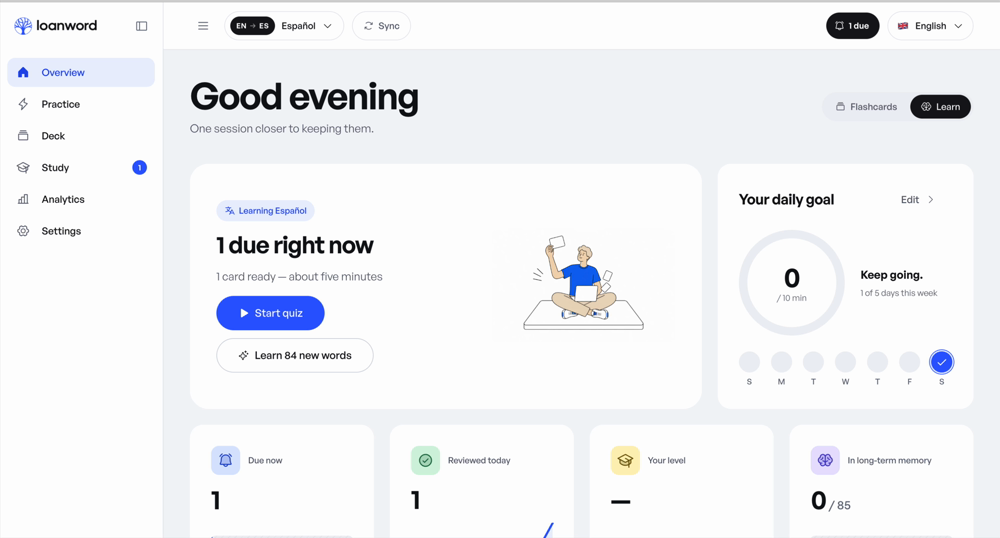
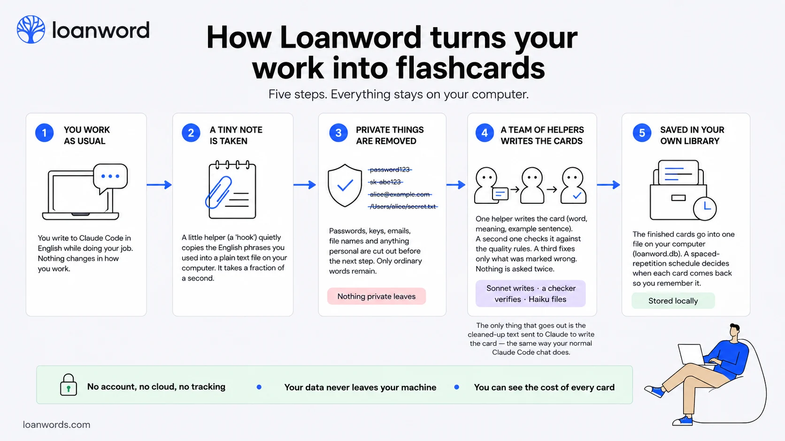
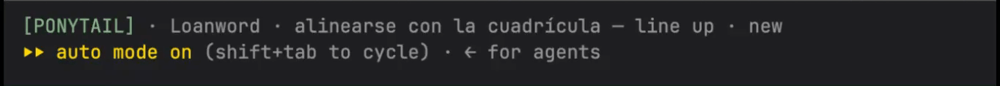

# The words you actually needed

[](LICENSE)
[](https://nodejs.org)
[](https://docs.claude.com/en/docs/claude-code/plugins)
[](#privacy)

**Your own Quizlet, Duolingo and Memrise, on one machine.** The drills are the
ones you already know — a flashcard pile, four-choice learn mode, matching, a
graded test, a daily goal, a streak, typed production before anything counts as
learned. The cards are generated from your Claude Code sessions — the words you
actually reached for, in the wording you reached for them. Out of those the
trainer assembles a study plan no one else could be handed: **unique to you,
unrepeatable**, and impossible to buy.

A Claude Code plugin. It captures the language you reach for while you work,
turns those words into flashcards, and schedules them with FSRS.

- Cards are written by the Claude you already pay for — no API key.
- No server, no account, no telemetry. The trainer binds `127.0.0.1`.
- One deck per language pair, several capturing at once.
- 35 languages in 13 scripts: Latin, Cyrillic, Greek, Hebrew, Arabic,
  Devanagari, Bengali, Thai, Ethiopic, Armenian, Georgian, Han, Hangul.

## See it work



## How it works



1. A `UserPromptSubmit` hook collects the phrases you reached for. Code, diffs
   and tool output are never captured.
2. At session end Claude turns the queue into cards — word, meaning, example,
   CEFR level, category, topic. A gate checks each one and sends the broken
   ones back once for repair.
3. You open the trainer and review. FSRS decides when a card comes back.

## Install

```
/plugin marketplace add MarcSky/loanword
/plugin install loanword
```

Asks for your native language, the language you are learning and the capture
mode. Needs Node 22.13 or newer.

## Inside Claude Code

| Command | What it does                                                            |
|---|-------------------------------------------------------------------------|
| `/loanword:start` | Opens the trainer at `localhost:4747`                                   |
| `/loanword:stats` | Progress: learned, streak, hardest words                                |
| `/loanword:ticker` | Claude Code widget with flashcards in the status line under your prompt |

No build command. The Overview says how many records are waiting, and **Build
now** opens the list first: one row per captured phrase, per language, so you
throw away what you already know before it costs a model call. Turn on *Make
cards automatically* in Settings if you would rather a session ending with ten
or more records build them by itself. `loanword build` forces it, and the very
first run — an empty deck with a full queue — builds without asking so the
trainer has something to show.

### Ticker



`/loanword:ticker` puts the open deck into Claude Code's status line: one card
under the prompt, weakest first, a new one every `ticker_every` seconds. You
watch the words you actually reached for go by while Claude works — no tab to
open, no session to start. `/loanword:ticker off` takes it back out.

## The trainer

Six screens, served off disk, no build step, no framework, no network.

| Screen | What it holds |
|---|---|
| Overview | What is due, the daily-goal ring, categories, eight weeks of rhythm, the build queue |
| Practice | Flashcards, Learn mode, and a graded Test — none of them touch the FSRS schedule |
| Deck | Search, filters, edit in place, star, remove with undo; Chapters groups by category and topic |
| Study | A planned session; a new card is shown once with both sides, then returns as a typed question |
| Analytics | Your review log, a table behind every chart, Markdown or CSV export |
| Settings | Languages, categories, capture, study, appearance, your data |

**[Every screen, one at a time →](SCREENSHOTS.md)**

## Many languages at once

- **One queue per language** — `queue.<code>.jsonl`, all appended in the same
  hook pass, so two languages cost the same keystrokes as one.
- **One switch per language** — Settings → *Collect words for* pauses a language
  without deleting its deck or schedule.
- **One schedule per deck** — studying `en → de` never moves a card in
  `en → es`.
- **Builds run side by side** — one lane per target; `loanword build
  --target=ka` narrows it to one.
- **Decks seed each other** — Sync copies the concepts you already learned and
  asks the builder for the new side. The schedule is never copied.
- **Offline speech only** — the browser's local voices, then Piper, macOS
  `say` or eSpeak NG. `loanword speech --lang=ka` prints the one command that
  fetches a voice.

Interface language is separate from the pair you learn: English, Spanish,
French, Portuguese, Russian, Hindi and Chinese ship in the box — see
[`ui/i18n/README.md`](ui/i18n/README.md) to add one.

## Your level

One CEFR estimate per deck, Elo over the **first** graded answer to each card.
No model call, no placement test. A band is named after a hundred first
answers, never above the hardest band the deck has tested ten times. A floor
set in Settings beats the arithmetic.

## What the cards cost

- `claude -p` on this machine, as a bare completion: no tools, no project
  context, no session history.
- Sonnet writes cards by default; Haiku and Opus are in Settings. Filing always
  runs on Haiku.
- The Claude subscription you are already signed into pays for it. Settings →
  *Use my API key* takes an Anthropic key instead; it is kept beside your deck
  in `settings.json`, and the trainer only ever shows its first and last
  characters.
- Every call's tokens and cost are logged, per model, over 1, 7 or 30 days.
- Nothing is asked twice: only cards the gate marked go back, one call a batch.
- A call over `MAX_CALL_USD` (3, or `LOANWORD_MAX_CALL_USD`) halves its batch
  instead of retrying. `scripts/tune.mjs` answers a failure with one change and
  remembers what worked in `tuning.json`.

## Two hooks, and nothing else

| Hook | Runs | Budget |
|---|---|---|
| `UserPromptSubmit` | `scripts/capture.mjs --source=prompt` | 10 s |
| `SessionEnd` | `scripts/capture.mjs --source=session` | 30 s |

Declared in [`hooks/hooks.json`](hooks/hooks.json). The prompt hook scrubs
secrets, splits the text against the stop-list and a snapshot of what you know,
and appends one line per active language — it never opens SQLite. At session
end only candidate words are taken from the assistant's replies, never the
sentences, and tool results and code blocks are skipped. A queue over 4 MB
stops accepting until `loanword build` drains it.

## Privacy

- Data lives in `~/.claude/plugins/data/loanword*`, or `CLAUDE_PLUGIN_DATA`.
- Code, diffs and tool output are never captured.
- Secrets are stripped before anything is written
  ([`scripts/scrub.mjs`](scripts/scrub.mjs)); removed text leaves a `▮`.
- To keep client repositories out: install at `user` scope and
  `claude plugin disable loanword` where it does not belong, or set
  `mode: active`.

Found a leak in `queue.jsonl`? That is a P0. Open an issue.

## Settings

Set at install time, changeable from the trainer. Stored in `settings.json` in
the plugin data directory; the stored value wins.

| Option | Default | Meaning |
|---|---|---|
| `native_lang` | `es` | The language you write prompts in |
| `target_lang` | `en` | The language you are learning |
| `mode` | `both` | `active`: your prompts; `passive`: assistant replies |
| `daily_limit` | `15` | New cards per day, 3 to 100. Reviews are never capped |
| `auto_build` | `false` | Build cards when a session ends, without asking |
| `echo` | `off` | `line`: open every reply with the native phrasing of your prompt; `weave`: also work your ten weakest words into the answer |
| `level` | — | `A1`…`C2`: words below this level never become cards |
| `peek` | `false` | Print one card into the session while you wait for an answer |
| `peek_pick` | — | Which cards may appear: `starred`, `slipping`, `leech`, `new`, and any CEFR levels |
| `peek_every` | `15` | Minutes between those cards, 1 to 120 |
| `ticker_every` | `30` | Seconds a word stays in the status line, 5 to 300 |

```
node scripts/store.mjs config    # effective settings
```

Language detection is local: different scripts by script, same-script pairs by
a function-word vote, Japanese and Chinese by kana, in
[`scripts/lang.mjs`](scripts/lang.mjs). Writing systems without spaces are
queued as short sentences rather than split into words.

## The `loanword` command

```
npm link                  # once, from the plugin folder; puts `loanword` on PATH
```

| Command | What it does |
|---|---|
| `loanword` | Serves the trainer and opens the browser |
| `loanword stop` | Closes it and releases the port |
| `loanword build` | Turns the queue into cards now |
| `loanword build --target=ka` | Builds one language instead of all of them |
| `loanword clone --from=en --to=ka` | Queues the concepts of one deck for another |
| `loanword vet` | Which cards break the lexis rules; `--apply` repairs them |
| `loanword speech --lang=ka` | Says which offline voice would speak, and how to get one |
| `loanword peek` | Prints one card the way the hook does; `--pick=starred,B1` narrows it |
| `loanword tidy` | Lists migrated leftovers and old backups; `--remove` deletes them |
| `loanword migrate` | Moves a JSONL deck into SQLite; `--dry-run` shows what would happen |
| `loanword --stats` | Progress as JSON, for scripts |
| `loanword --where` | Which plugin copy and which deck it reads |

| Flag | Meaning |
|---|---|
| `--no-open` | Do not open the browser |
| `--host=lan` | Bind every interface and print a URL with a one-off token. Without it, loopback only |
| `--idle=<minutes>` | Close after that long without a request. Default 30, `0` never. `LOANWORD_IDLE_MINUTES` sets the same thing |
| `LOANWORD_PORT=<port>` | Move off 4747 |
| `NO_COLOR=1` | Plain startup banner |

`Ctrl+C`, `SIGTERM` or `loanword stop` close it cleanly: connections finished,
database closed, port released.

## Export to Anki

The **Export to Anki** button in Settings downloads a CSV, and every build
writes `export/loanword.csv` into the data directory.

1. Anki → **File → Import**
2. Field separator: semicolon `;`
3. Fields in order: `front`, `back`, `reading`, `example`, `tags`
4. Treat the first line as a header

Tags look like `loanword lang:en from:es cefr:B1 cat:process type:word
topic:code_review`, plus `project:<repo>` when the card knows where it was met.

## Stop-lists

Words from the stop-list never become cards. Every language in the picker ships
with one, in [`data/freq/`](data/freq/) — see the
[README there](data/freq/README.md) for where they came from and how to swap in
a counted frequency list.

## Development

```
npm ci
npm test                             # unit, storage, migration, analytics, HTTP
npm run test:perf                    # 50k cards, 500k reviews, against the budget
npm run i18n                         # dictionaries complete and well-formed
npm run tokens                       # export the palette as design tokens
npm run icons                        # regenerate ui/icons.svg from the Phosphor map
npm run vendor                       # regenerate ui/vendor/ from node_modules
npm run stem                         # regenerate the Snowball stemmers
claude plugin validate . --strict
```

See [CONTRIBUTING.md](CONTRIBUTING.md) before opening a pull request.

Storage is one SQLite file, `loanword.db`. Copy it while the trainer is closed
and you have a backup. Older decks migrate themselves on first start;
`node scripts/migrate.mjs --rollback` puts the old files back. Schema changes go
through the numbered ladder in [`scripts/db.mjs`](scripts/db.mjs): the deck is
copied into `backup/` first, and every step is its own transaction.

Assets are vendored so the trainer works with zero network:
[Phosphor](https://phosphoricons.com) icons (MIT) in `ui/icons.svg`,
[General Sans](https://fontshare.com/fonts/general-sans) by Indian Type Foundry
(ITF Free Font License) in `ui/fonts/`, and three
[Web Awesome](https://webawesome.com) components (MIT) in `ui/vendor/`.

MIT.
