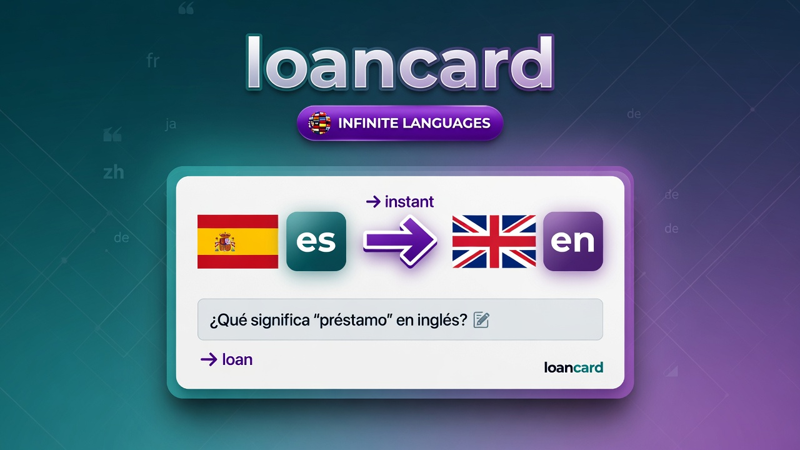

# Loanword



**Main idea: fit the foreign language to the shape of your native one.**

You already think in a language. Loanword does not hand you someone else's
word list. It watches what *you* try to say in Claude Code, notices where your
native language and the one you are learning part ways, and turns exactly those
words into flashcards. The deck is yours because the gaps are yours.

- Works inside Claude Code. No API key: cards are built on your own subscription.
- Everything stays on your machine. No server, no account, no telemetry.
- One deck per language pair. Learn `es → en` and `en → es` side by side, and
  capture into several of them at once.
- Thirty-five languages, whatever they are written in: Georgian, Armenian,
  Hindi, Bengali, Thai, Amharic, Arabic, Hebrew, Japanese, Chinese, Korean.

## How it works

1. **You work as usual.** A hook collects the phrases you reached for.
2. **A session ends.** Claude turns the queue into cards: the word, what it
   means in your language, an example, a level (A1 to C2), a domain. A gate
   checks every card against the lexis rules and sends the broken ones back
   once for repair; every call's tokens and cost are logged and shown in
   Settings.
3. **You open the trainer.** Pick 5, 10 or 15 minutes and review. FSRS decides
   when each card comes back.

## Install

```
/plugin marketplace add MarcSky/loanword
/plugin install loanword
```

The installer asks for your native language, the language you are learning and
the capture mode. Needs Node 22.16 or newer.

## Inside Claude Code

| Command | What it does |
|---|---|
| `/loanword:review` | Opens the trainer at `localhost:4747` |
| `/loanword:stats` | Progress: learned, streak, hardest words |

There is no build command inside Claude Code. When a session ends with 10 or
more captured records, a detached `claude -p` reads the queue and writes the
cards. Opening the trainer does the same for anything captured since. To force
it, use `loanword build` from the terminal.

## The `loanword` command

The trainer is also a plain CLI, for when you want it without Claude Code.

```
npm link                  # once, from the plugin folder; puts `loanword` on PATH
```

| Command | What it does |
|---|---|
| `loanword` | Serves the trainer and opens the browser |
| `loanword stop` | Closes it and releases the port |
| `loanword build` | Turns the queue into cards now |
| `loanword --stats` | Progress as JSON, for scripts |
| `loanword --where` | Which plugin copy and which deck it reads |
| `loanword build --target=ka` | Builds one language instead of all of them |
| `loanword clone --from=en --to=ka` | Copies the concepts of one deck into another |
| `loanword speech --lang=ka` | Says which offline voice would speak, and how to get one |
| `loanword peek` | Prints one card from the deck, the way the hook does |
| `loanword tidy` | Lists migrated leftovers and old backups; `--remove` deletes them |
| `loanword migrate --dry-run` | What the JSONL → SQLite move would do |
| `loanword migrate` | Does it (also runs itself on first start) |

Flags and environment:

| Flag | Meaning |
|---|---|
| `--no-open` | Do not open the browser |
| `--host=lan` | Bind every interface and print a URL with a one-off token. Without it, loopback only |
| `--idle=<minutes>` | Close after that long without a request. Default 30, `0` never |
| `LOANWORD_PORT=<port>` | Move off 4747 |
| `NO_COLOR=1` | Plain startup banner |

On start it prints where it serves, which deck is open, how many cards are due
and where the data lives. `Ctrl+C`, `SIGTERM` or `loanword stop` close it
cleanly: open connections are finished, the database is closed, the port is
released. Nothing is ever left holding the port.

## The trainer

Five screens, served off disk, no build step, no framework, no network.

- **Overview**: what is due, four numbers, domains, eight weeks of rhythm.
- **Deck**: search, filters, list or grid, edit in place, star, remove with undo.
- **Study**: pick a length, get a planned session. A new card is shown once
  with both sides, then comes back three to five cards later as a typed
  question — it is never graded before you have produced it. Five exercises
  share one FSRS schedule: flashcards, learn (four choices), cloze, type it,
  reverse. Swipe left for Again, right for Good; `s` says the phrase out loud.
- **Analytics**: everything from your own review log, with a table behind
  every chart.
- **Settings**: languages, capture, study, appearance, export.

The header carries the language switcher. Open it to jump between decks or add
a language; each `native → target` pair is its own deck with its own schedule,
and switching never touches the others. Known-word lists are per target
language too.

Keyboard: `space` reveals, `1 2 3 4` grade, `d` junks (and asks why), `u` undoes
that, `s` speaks, `1`–`5` switch screens, `/` searches, `t` toggles theme, `?`
lists shortcuts, `esc` leaves a session.

**Copy a deck.** Starting a second language does not start from nothing:
Settings → *Copy a deck* takes the concepts you already learned — your own
phrasing, the domain, the level, the star — and asks the builder for the new
side. The schedule is never copied, and the deck you copied from is not
touched. A new script also offers its alphabet as a starter deck.

**Say it out loud.** Offline voices only: the browser's local ones first, then
Piper, macOS `say` or eSpeak NG on this machine. `loanword speech --lang=ka`
prints the one command that fetches a Piper voice — it never runs it, and no
audio ever leaves the machine.

**Words in your status line.** `/loanword:ticker` puts one card into Claude
Code's status line — the weakest words of the open deck, a new one every ten
seconds — read from the snapshot the trainer already writes, so it never
opens the database or spends a model call. `/loanword:ticker off` restores
what was there before.

**Chapters.** Deck → Chapters groups the deck by domain and topic — code
review, airport, standup — in parts of forty, closed until opened, each with
its own Study button. Chapters are views computed from the cards, never an
order of study.

Interface language is separate from the pair you learn. English ships in the
box; see [`ui/i18n/README.md`](ui/i18n/README.md) for the rest.

## Privacy

- Everything lives in `~/.claude/plugins/data/loanword*`. The server binds
  `127.0.0.1` only.
- Code, diffs and tool output are never captured. From assistant replies only
  candidate words are stored, never the sentence.
- Secrets are stripped before anything is written: rules in
  [`scripts/scrub.mjs`](scripts/scrub.mjs). Removed text leaves a `▮`.

Found a leak in `queue.jsonl`? That is a P0. Open an issue.

## Settings

Set at install time, changeable from the trainer. Stored in `settings.json` in
the plugin data directory; the stored value wins.

| Option | Default | Meaning |
|---|---|---|
| `native_lang` | `es` | The language you write prompts in |
| `target_lang` | `en` | The language you are learning |
| `mode` | `both` | `active`: your prompts; `passive`: assistant replies |
| `daily_limit` | `15` | New cards per day. Reviews are never capped |
| `auto_build` | `true` | Build cards when a session ends |
| `echo` | `off` | `line`: open every reply with the native phrasing of your prompt; `weave`: also work your ten weakest words into the answer |
| `level` | — | `A1`…`C2`: words below this level never become cards |

```
node scripts/store.mjs config    # effective settings
```

Language detection is local: different scripts by script, same-script pairs by
a function-word vote, Japanese and Chinese by kana, in
[`scripts/lang.mjs`](scripts/lang.mjs). Writing systems without spaces are
queued as short sentences rather than split into words.

Two more settings live only in the trainer. **Show a card while Claude works**
prints one card into the session while you wait for an answer — the words
closest to being forgotten, or the ones you starred, at most one every fifteen
minutes. **One sentence of your own** asks for a sentence at the end of a
session and answers with a single line; the sentence itself is never stored.

To keep client repositories out: install at `user` scope and
`claude plugin disable loanword` where it does not belong, or use
`mode: active` so only your own wording is captured.

## Export to Anki

The **Export for Anki** button in the trainer downloads a CSV. Every build also
writes `export/loanword.csv` into the data directory.

1. Anki → **File → Import**
2. Field separator: semicolon `;`
3. Fields in order: `front`, `back`, `reading`, `example`, `tags`
4. Treat the first line as a header

Tags look like `loanword lang:en from:es cefr:B1 cat:process project:api`.

## Stop-lists

Words from the stop-list never become cards. Every language in the picker ships
with one, in [`data/freq/`](data/freq/) — see the
[README there](data/freq/README.md) for where they came from and how to swap in
a counted frequency list instead.

## Development

```
npm ci
npm test                             # unit, storage, migration, analytics, HTTP
npm run test:perf                    # 50k cards, 500k reviews, against the budget
npm run i18n                         # dictionaries complete and well-formed
npm run tokens                       # export the palette to docs/design/tokens.json
claude plugin validate . --strict
```

See [CONTRIBUTING.md](CONTRIBUTING.md) before opening a pull request.

Storage is one SQLite file, `loanword.db`: the deck, the FSRS schedule, every
review, every session, the junk log and the retired wordings. Copy it while the
trainer is closed and you have a backup. Decks written by an earlier version
migrate themselves on first start; `node scripts/migrate.mjs --rollback` puts
the old files back.

The capture hooks write only `queue.<code>.jsonl` and never open the database —
they read plain-text snapshots of the known words and of the fronts worth
watching for. That is what keeps `UserPromptSubmit` fast, and what lets several
languages capture at once without waiting on each other.

Schema changes go through the numbered ladder in
[`scripts/db.mjs`](scripts/db.mjs): the deck is copied into `backup/` before the
first step runs, and every step is its own transaction.

Design tokens are generated from `ui/app.css` into `docs/design/tokens.json`
by `npm run tokens`; the landing page at loanwords.com builds from the same
export. Assets are vendored so the UI works offline: [Lucide](https://lucide.dev)
icons (ISC) in `ui/icons.svg`, [General Sans](https://fontshare.com/fonts/general-sans)
by Indian Type Foundry (ITF Free Font License).

## Contact

Built by **[@levan_fewnix](https://x.com/levan_fewnix)** on X. MIT.
