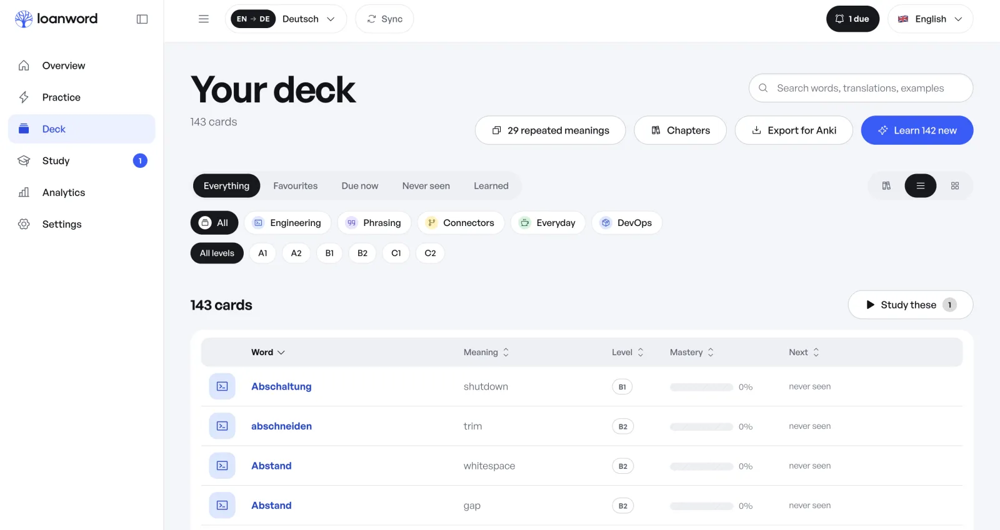
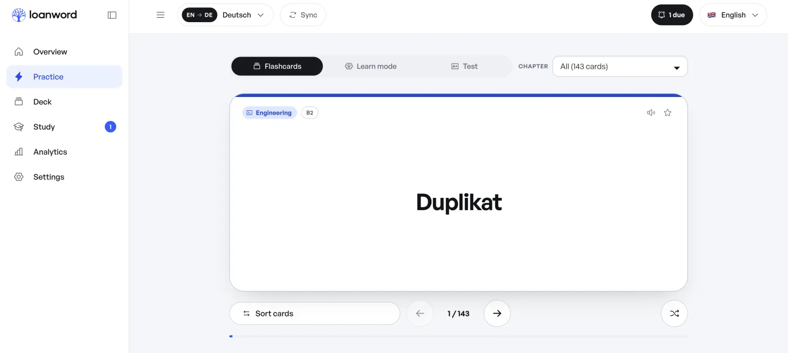
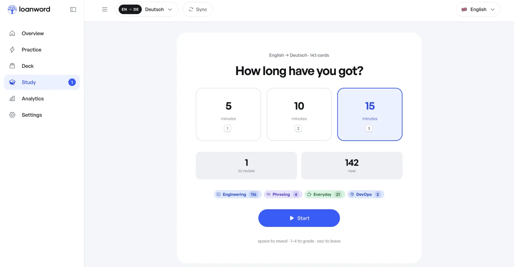
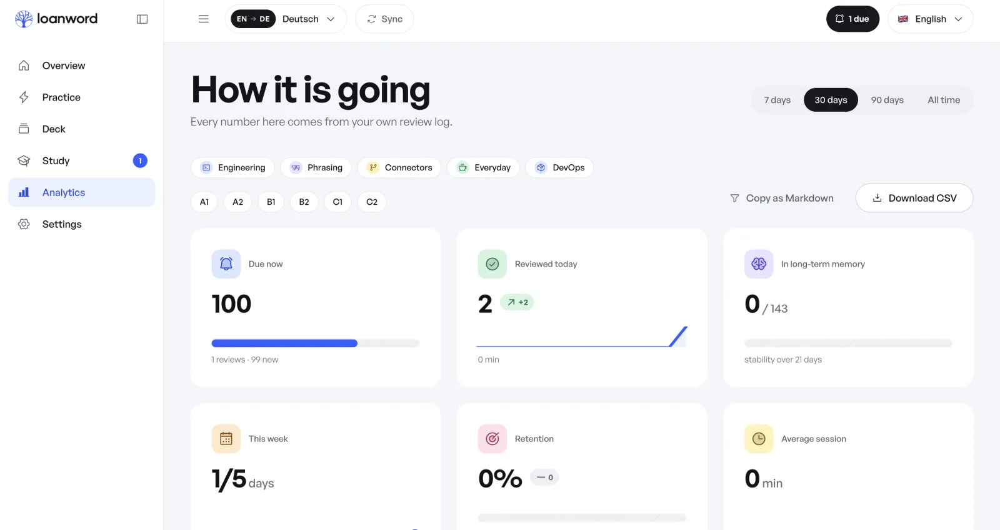
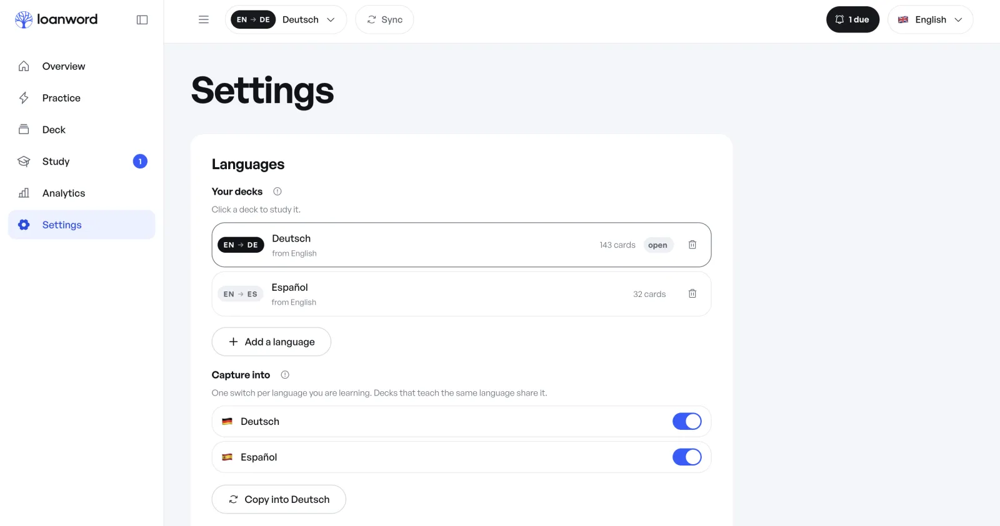
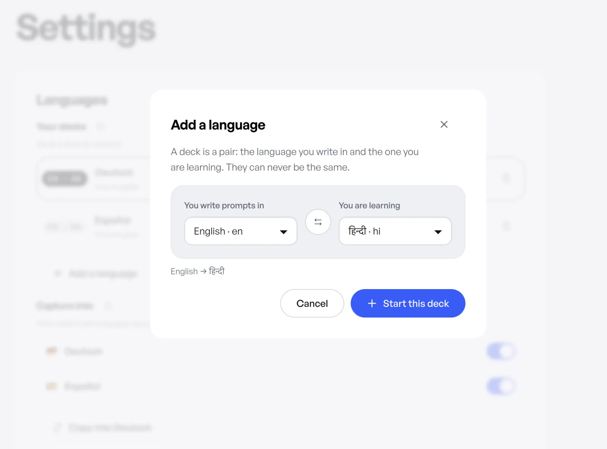
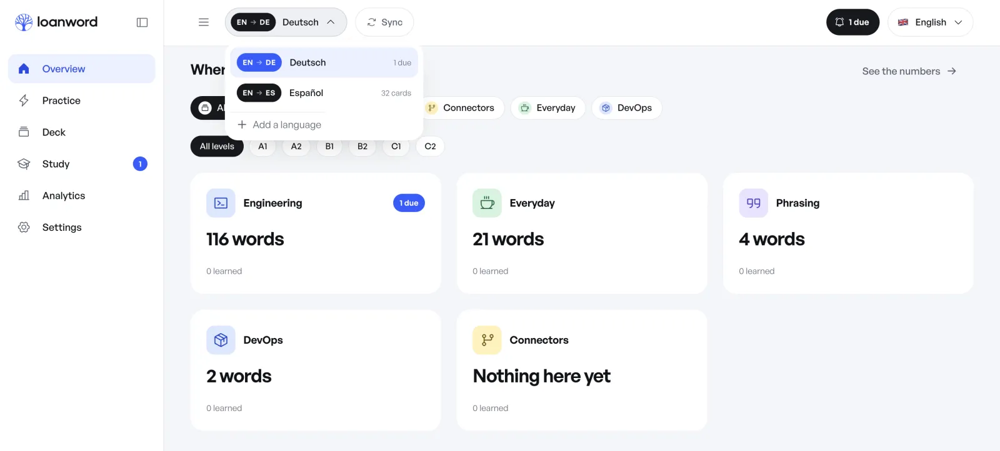

# The trainer, screen by screen

Nine screenshots from a real `en → de` deck — 143 cards, none of them chosen
by anyone but the work. Nothing here is a mock-up, which is why the numbers are
as unflattering as they were on the day.

## Overview

The first thing you see is one number, and it is usually small. The ring counts
minutes, not cards, because fifteen minutes is a promise you can keep and
"twenty cards" is not. *Your level* is a dash until a hundred first answers have
paid for it — the trainer would rather say nothing than guess. Behind the second
button, 142 words are still queued from last week's sessions.

## Deck

Everything you have ever reached for, in one table. *29 repeated meanings*
is not a bug report: `Abstand` is whitespace in one session and a gap in the
next, and both cards stay, because you met both. Filter by state, by category,
by level; edit in place; star what matters; export the lot to Anki when you
want it somewhere else.

## Practice

Three ways to drill that never touch the schedule. `Duplikat` is tagged
*Engineering* and *B2* because that is where it was met — a code review, not a
textbook. Flip through the whole pile, run Learn mode until the misses stop, or
sit an actual test. FSRS does not watch any of it, so you can be as wrong as you
like in here.

## Study

The only question the trainer asks before a session is how long you have got.
Everything else it works out: how many of the 142 new words fit in fifteen
minutes next to the one review that is actually due, and in what order. A new
card is shown once with both sides, then comes back three to five cards later as
a typed question — nothing is graded before you have produced it once. The
keys are on the screen because you will want them on the second day, not the
first.

## Analytics

Every number comes from your own review log, and there is a table behind every
chart. Nothing is modelled, inferred or phoned home — 0% retention on day one
means you have answered nothing yet, not that the algorithm is disappointed in
you. Copy the lot as Markdown, or take the CSV.

## Settings — languages

Each `native → target` pair is its own deck with its own schedule; opening one
never disturbs the other. The switches below are separate on purpose: you can
learn German and capture into Spanish at the same time, from the same day's
work.

## Adding a language

A deck is a pair, and the two halves can never be the same. Thirty-five
languages in thirteen scripts, so `en → hi` is one dialog and no setup — a new
script also offers its alphabet as a starter deck, which beats an empty screen.

## Switching decks

The picker lives in the header because switching is a thing you do mid-session,
not a thing you configure. Behind it, the deck grouped the way you actually met
it: 116 words from Engineering, 21 from Everyday, and *Connectors* still saying
"Nothing here yet" — an honest empty state instead of a zero.

## What the cards cost

Every call to `claude -p` is logged with its tokens and its cost, per model,
over one, seven or thirty days. Ninety-eight of these hundred-and-one calls were
Haiku doing the filing; Sonnet was asked three times, for the writing that
needed it. You picked the model, so you get to see the bill.
